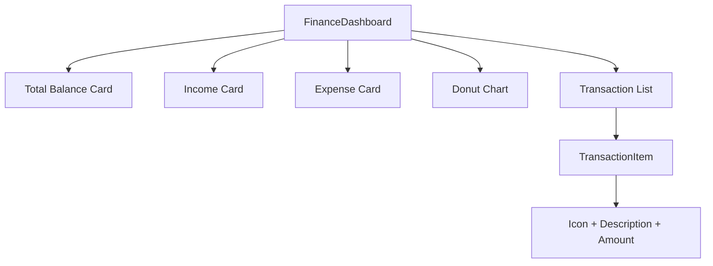

# UI Diagram (auto‑generated)

```mermaid
graph TD
    A[FinanceDashboard] --> B[Total Balance Card]
    A --> C[Income Card]
    A --> D[Expense Card]
    A --> E[Donut Chart]
    A --> F[Transaction List]
    F --> G[TransactionItem]
    G --> H[Icon + Description + Amount]
```
